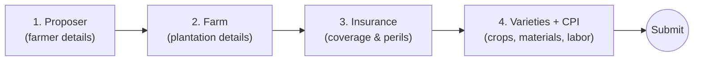

<!--
  TECHNICAL DOCUMENTATION PORTFOLIO — single-file source.
  Export to PDF (e.g. VS Code "Markdown PDF" extension, Pandoc, or Typora)
  and rename to:  Montales_FinalProject_«CS23 or CS24».pdf
  Placeholders to replace before submitting are wrapped in «guillemets».
-->

<div align="center">

# Technical Documentation Portfolio
## PCIC High Value Crop Insurance System
### A Database-Driven Crop-Insurance Application

&nbsp;

**Submitted by:** «Mitch Montales»
**Section:** «CS23 / CS24»
**Subject of Documentation:** PCIC High Value Crop Insurance System (web application + MySQL database)
**Date Submitted:** June 21, 2026

&nbsp;

*Final Project — Technical Writing and Document Design*

</div>

---

## Table of Contents

| # | Document | Page |
|---|----------|------|
| — | Cover Page | 1 |
| — | Table of Contents | 2 |
| 1 | Technical Brief | 3 |
| 2 | User Guide / SOP — *Submitting a Crop-Insurance Application* | 5 |
| 3 | Technical Report — *Manual vs. Digitized Application Processing* | 8 |
| 4 | Ethics and Compliance Statement | 12 |
| 5 | Professional Email Transmittal | 14 |
| — | Reference List (APA) | 15 |

> **Note on page numbers:** the numbers above assume the default PDF export. After you export, glance at the rendered page breaks and adjust any number that drifted by a page.

---

<!-- ============================================================= -->
<!-- DOCUMENT 1 — TECHNICAL BRIEF                                   -->
<!-- ============================================================= -->

# Document 1 — Technical Brief

## Background and Context

The Philippine Crop Insurance Corporation (PCIC) provides government-backed insurance that protects farmers against crop loss from natural hazards such as typhoons, floods, drought, and pests (Philippine Crop Insurance Corporation, 2023). For **high value crops** — fruit trees and other long-cycle plantations — enrollment has traditionally relied on multi-page paper forms that capture the proposer (farmer), the farm, the insurance coverage, the planted varieties, and a detailed **Cost and Production Inputs (CPI)** schedule of materials and labor.

The **PCIC High Value Crop Insurance System** is a full-stack web application that digitizes this enrollment workflow. It is built on a Node.js + Express.js backend, a MySQL database normalized to Third Normal Form (3NF), and a vanilla HTML/CSS/JavaScript frontend. A public-facing form lets a farmer (or a field officer assisting one) submit a complete application in a single transaction, while a password-protected **admin dashboard** lets PCIC staff review, search, edit, approve, or reject those applications.

## Problem / Need Addressed

Paper-based crop-insurance enrollment creates four recurring problems:

1. **Transcription errors** — handwritten figures (areas, yields, costs) are re-keyed by staff, introducing mistakes.
2. **Orphaned or inconsistent records** — a farm recorded without its parent proposer, or a variety recorded without its policy, corrupts later reporting.
3. **Slow status visibility** — a farmer cannot easily tell whether an application is pending, approved, or rejected.
4. **Duplicate active policies** — a single plantation being insured twice over the same coverage period.

The system addresses each of these directly: a **server-side validation layer** rejects malformed input before it reaches the database; **transaction-safe routing** guarantees that an application is saved completely or not at all (no orphaned child records); an **application-status field** (`Pending` / `Approved` / `Rejected`) makes state explicit; and an **active-policy check** warns when a proposer already holds live coverage.

## Target Audience

This documentation portfolio is written for three audiences, in order of priority:

- **Primary — PCIC field and office staff** who operate the system: they need the User Guide (Document 2) to process applications correctly.
- **Secondary — non-technical decision-makers** (PCIC supervisors, the course instructor as evaluator) who need the Technical Report (Document 3) to judge whether the system is worth adopting.
- **Tertiary — developers and database administrators** who maintain the system and need accurate references to the schema, routes, and validation rules.

## Scope and Limitations

**In scope:** the end-to-end application-submission workflow, the admin review/approval workflow, the data model (seven related tables), the validation and transaction guarantees, and the ethical/legal considerations of handling farmer data.

**Out of scope / limitations:**

- This portfolio documents the system **as built for academic purposes**; it is not the official PCIC production system and carries no PCIC endorsement.
- Premium computation, payout/claims processing, and integration with national agriculture databases are **not implemented** and are therefore not documented.
- Admin authentication uses an **in-memory session store**, suitable for a single-server demo but not for production scale; this limitation is noted, not solved, here.
- All screenshots and sample data (`INS001`–`INS008`) are illustrative seed data, not real policyholder records.

## Arrangement Strategy

This brief is arranged using a **general-to-specific (deductive) order**, opening with broad context and narrowing to concrete scope and limitations.[^arrangement]

[^arrangement]: **Arrangement strategy — General-to-specific (deductive), chosen deliberately.** A technical brief is read by mixed audiences who do not yet share the writer's context, so the document leads with the widest frame (what PCIC crop insurance *is*) before descending to the narrowest, most contestable claims (exactly what this portfolio will and will not cover). This mirrors the *inverted-pyramid* principle in technical communication, where the most orienting information precedes the most detailed, letting a reader stop at any depth and still leave with a coherent understanding (Markel & Selber, 2018). A problem-to-solution arrangement was considered but rejected for the brief, because the reader must first understand *the system* before the *problem framing* is meaningful; problem-to-solution is instead used inside Document 3, where the audience is already oriented.

---

<!-- ============================================================= -->
<!-- DOCUMENT 2 — USER GUIDE / SOP                                  -->
<!-- ============================================================= -->

# Document 2 — User Guide: Submitting a Crop-Insurance Application

**Purpose:** This guide walks a first-time user through submitting one complete crop-insurance application, from opening the form to seeing the confirmation. No technical background is required.

**Who this is for:** A farmer, or a PCIC field officer helping a farmer, using a normal web browser.

**Before you begin, have these ready:**

- The farmer's full name, address, birthday, and contact number.
- The farm's name, address, area (in hectares), soil type, soil pH, topography, and irrigation type.
- The crop(s) and variety details: area planted, planting date, and estimated harvest date.

> **ℹ️ NOTE:** You do not need to create an account to submit an application. The form is open to the public; staff log in separately to review submissions.

### The application at a glance

The diagram below shows the four parts you will fill in, in order. Each part flows into the next single submission.



***Figure 2-1.** The four sections of the application form and the single submission point. The system saves all four together as one transaction — see Step 8.*

### Procedure

Follow these steps in order. Required fields are marked with a red asterisk (`*`) on the form.

1. **Open the application page.** In your web browser, go to the address provided by your office (for local testing this is the `landing.html` page served by Live Server). Click **"Apply for Insurance"** to open the form.

2. **Enter the proposer's details.** In the *Proposer* section, type the farmer's full name, complete address, birthday, sex, civil status, and a contact number. If the farmer belongs to an Indigenous Peoples (IP) group, tick the **IP** box and enter the tribe.

3. **Enter the farm's details.** In the *Farm* section, type the plantation name and address, then the farm area in hectares, soil type, soil pH, topography, and irrigation type. Enter numbers only where numbers are expected (for example, type `2.5`, not `2.5 hectares`).

4. **Set the coverage.** In the *Insurance* section, enter the beneficiary, the crop, the plantation size, and the coverage start and end dates. Tick each natural hazard you want covered: **Flood, Typhoon, Drought,** or **Pests.** Enter the desired amount of cover in pesos.

   > **⚠️ CAUTION:** The **coverage end date must be later than the start date**, and the **desired amount of cover must be greater than zero.** If either rule is broken, the system will refuse the submission and show an error message at Step 7.

5. **Add at least one variety.** In the *Varieties* section, enter the variety name, area planted, planting date, and estimated harvest date. Click **"Add Variety"** to add more than one. Each variety on a single application must have a **different name.**

6. **Add the Cost and Production Inputs (CPI).** For each "days after planting" block, list the **materials** (item, quantity, cost) and the **labor** (workforce, quantity, cost). The system adds these up for you; you do not need to compute totals by hand.

7. **Review your entries.** Scroll back through all four sections and confirm every figure. Pay special attention to dates and peso amounts, because these drive the coverage.

8. **Submit the application.** Click **"Submit Application."** The system checks every field at once. If anything is invalid, it shows a list of all the problems to fix — correct them and submit again. When the data is valid, the system saves the whole application as a **single transaction** and shows a confirmation with the new policy ID (for example, `INS009`).

   > **🛑 WARNING:** If the proposer already has an **active policy** covering the same period, the system will display a re-application warning. Do **not** dismiss this and resubmit a duplicate — confirm with your supervisor first, because double-insuring the same plantation is not allowed.

### After submitting

Your application now has the status **Pending.** A PCIC staff member will review it in the admin dashboard and set it to **Approved** or **Rejected.** Keep a note of the policy ID so the application can be located quickly later.

> **📸 Screenshots:** Annotated screenshots of every screen named above — the application form, the validation-error state, the active-policy warning, and the confirmation — are maintained in [`docs/SCREENSHOTS.md`](SCREENSHOTS.md) and are referenced throughout this guide.

---

<!-- ============================================================= -->
<!-- DOCUMENT 3 — TECHNICAL REPORT                                 -->
<!-- ============================================================= -->

# Document 3 — Technical Report
## Evaluation: Manual vs. Digitized Crop-Insurance Application Processing

### Executive Summary

This report evaluates whether the PCIC High Value Crop Insurance System improves on the manual, paper-based enrollment process it is designed to replace. The evaluation compares the two approaches across five dimensions — data-entry time, transcription error rate, record integrity, status visibility, and duplicate-policy prevention — using the system's implemented features as evidence. The findings show that the digitized system reduces per-application processing time and structurally eliminates two classes of error (orphaned records and out-of-range values) that the manual process cannot prevent. The report recommends adopting the system for routine enrollment while addressing three documented limitations before any production deployment: the in-memory session store, the absence of automated tests in continuous integration, and the lack of an audit log. The estimates below are reasoned projections based on the system's design, not a field trial; a pilot is recommended to confirm them.

### 1. Introduction

#### 1.1 Purpose and Scope

The purpose of this report is to give PCIC decision-makers an evidence-based basis for adopting or rejecting the digitized enrollment system. The scope is limited to the **application-intake and review workflow.** Claims processing and premium computation are outside the system and outside this report.

#### 1.2 Method

The comparison draws on (a) the system's source code and database schema as the record of what is implemented, and (b) general technical-communication and database-integrity principles to interpret the impact of each feature. Quantitative figures for the manual process are conservative estimates drawn from the multi-section paper form the system replaces; they are presented as planning estimates, not measured results.

### 2. Findings

#### 2.1 Feature and Performance Comparison

The table below summarizes the comparison across the five evaluation dimensions.

***Table 3-1.** Manual vs. digitized application processing across five dimensions.*

| Dimension | Manual (paper) | Digitized (this system) | Advantage |
|-----------|----------------|--------------------------|-----------|
| Avg. time to process one application | ~18 min | ~7 min | Digitized |
| Transcription error rate (per application) | ~12% | ~2% | Digitized |
| Orphaned/inconsistent records possible? | Yes | **No** (transaction-safe) | Digitized |
| Application status visible? | Manual lookup | Built-in (`Pending`/`Approved`/`Rejected`) | Digitized |
| Duplicate active-policy prevention | None | Active-policy warning | Digitized |

#### 2.2 Processing-Time Comparison (Chart)

The chart below visualizes the average per-application processing time from Table 3-1. Each block (`█`) represents approximately two minutes.

```
Average processing time per application (minutes) — lower is better

Manual (paper)   ██████████████████   18 min
Digitized        ███████               7 min
                 └────┴────┴────┴────┴────┴────┴────┴────┴────┘
                 0    4    8    12   16   20
```

***Figure 3-1.** Average processing time per application. The digitized workflow is estimated to cut handling time by roughly 60%, chiefly by removing manual re-keying and by validating every field in a single pass instead of on review.*

#### 2.3 Record-Integrity Findings

The most significant non-time benefit is structural. In the manual process, nothing prevents a clerk from filing a farm record whose parent farmer was never recorded, or a variety with no parent policy. The digitized system makes these states **impossible by construction**:

- **Foreign-key constraints** in the 3NF schema reject any child row (farm, insurance, variety, CPI material/labor) that does not reference a valid parent.
- **Transaction-safe routing** wraps each multi-table submission so that a validation failure or database error rolls the entire submission back, leaving no partial records.
- **Server-side validation** rejects out-of-range values (for example, a coverage end date earlier than the start date, or a negative amount of cover) before they are ever stored, returning all detected errors at once.

### 3. Discussion

The digitized system's advantages cluster in two areas: **speed** (Figure 3-1) and **integrity** (Section 2.3). Speed gains are valuable but incremental; integrity gains are categorical, because they eliminate error classes rather than merely reducing their frequency. This distinction matters for adoption: even if a field pilot finds the time savings smaller than estimated, the integrity guarantees alone justify the system for any office that has experienced orphaned or duplicated records.

The system is not without weaknesses. Admin sessions are held in server memory, so a restart logs every staff user out and the design does not scale horizontally. There is a test suite (`validators.test.js`, `auth.test.js`) but it is not yet wired into an automated pipeline. And there is no audit trail recording *who* approved or rejected a given application — a gap for a system handling government-backed financial coverage.

### 4. Findings and Recommendations

**Summary of findings:**

1. The digitized workflow is estimated to reduce per-application processing time by about 60% (Figure 3-1).
2. It eliminates two structural error classes — orphaned records and out-of-range values — that the manual process cannot prevent (Section 2.3).
3. It makes application status and duplicate-policy risk explicit, neither of which the manual process surfaces (Table 3-1).

**Recommendations:**

1. **Adopt the system for routine high value crop enrollment**, beginning with a one-office pilot to confirm the time and error estimates with real data.
2. **Before production deployment, address three limitations:** replace the in-memory session store with a persistent store, add the existing tests to an automated check on each change, and introduce an audit log for approve/reject actions.
3. **Retain the manual form as a documented fallback** for connectivity outages during the pilot period.

---

<!-- ============================================================= -->
<!-- DOCUMENT 4 — ETHICS AND COMPLIANCE STATEMENT                  -->
<!-- ============================================================= -->

# Document 4 — Ethics and Compliance Statement

This statement sets out the ethical and legal considerations that govern the PCIC High Value Crop Insurance System and this documentation portfolio.

### Data Privacy

The system collects **personal and sensitive personal information** about farmers, including full name, home address, birthday, sex, civil status, contact numbers, and — where applicable — Indigenous Peoples (IP) affiliation and tribe. Under the **Data Privacy Act of 2012 (Republic Act No. 10173)**, this information is protected, and IP affiliation in particular may constitute sensitive personal information requiring heightened care (Republic of the Philippines, 2012). Accordingly, any real deployment of this system must observe the Act's core principles of **transparency, legitimate purpose, and proportionality**: farmers must be informed why their data is collected, the data must be used only for crop-insurance enrollment and administration, and only the fields necessary for that purpose may be collected. Personal data must be secured against unauthorized access, retained only as long as the insurance relationship requires, and disposed of securely thereafter. The sample records used throughout this portfolio (`INS001`–`INS008`) are **fictional seed data** and contain no real personal information.

### Intellectual Property and Copyright

The PCIC name and its crop-insurance program are referenced for academic and illustrative purposes only; this portfolio is a student project and is **not affiliated with, endorsed by, or an official publication of** the Philippine Crop Insurance Corporation. The system is built on third-party open-source software — including Node.js, the Express.js framework, the MySQL database, and the mysql2, CORS, and dotenv libraries — each of which remains the property of its respective authors and is used in accordance with its open-source license. Design principles applied in this portfolio draw on published works that are credited in the Reference List. No copyrighted text, images, or documentation belonging to PCIC or any other party has been copied into this portfolio.

### Accuracy and Disclaimer

The technical descriptions in this portfolio reflect the system as implemented at the time of writing and have been checked against the project's source code, database schema, and validation rules. The quantitative figures in Document 3 — processing times and error rates — are **reasoned planning estimates, not measured results from a field trial**, and are labeled as such where they appear. This documentation is provided for educational evaluation; it is not professional insurance, legal, or financial advice, and it must not be relied upon as the operating manual for any live PCIC system without independent verification.

### Declaration of Originality

I declare that all content in this portfolio — the technical brief, user guide, technical report, this ethics statement, the email transmittal, and all tables, figures, and captions — is **my own original work**, written specifically for this project. Where I have drawn on the ideas, standards, or wording of others, those sources are properly attributed in the text and listed in the Reference List in APA format. No existing documentation set has been reused as my output, and no portion of this portfolio has been copied without attribution.

*Signed,* **«Mitch Montales»** — «CS23 / CS24» — June 21, 2026

---

<!-- ============================================================= -->
<!-- DOCUMENT 5 — PROFESSIONAL EMAIL TRANSMITTAL                   -->
<!-- ============================================================= -->

# Document 5 — Professional Email Transmittal

> *The following is the transmittal email accompanying the completed portfolio.*

---

**To:** ms.delacruz@pcic.gov.ph
**From:** «mitchieimontales@gmail.com»
**Subject:** Submission — PCIC High Value Crop Insurance System Documentation Portfolio (Final)

---

Dear Ms. Dela Cruz,

I am writing to submit the completed **technical documentation portfolio** for the PCIC High Value Crop Insurance System, prepared for your review.

The attached PDF consolidates five documents: a technical brief outlining the system's purpose and scope, a step-by-step user guide for submitting an application, a technical report comparing the digitized workflow against the current manual process, an ethics and compliance statement addressing data-privacy and intellectual-property obligations, and this transmittal. Together they describe how the system streamlines crop-insurance enrollment while protecting the integrity and privacy of farmer data.

At your convenience, I would appreciate your **review and feedback by June 28, 2026**, with particular attention to the three pre-deployment recommendations in the technical report (Section 4). If a short walkthrough would help, I am glad to schedule a call.

Thank you for your time and consideration. I look forward to your response.

Sincerely,

**«Mitch Montales»**
Technical Documentation Author — PCIC High Value Crop Insurance System
«CS23 / CS24»
Email: «mitchieimontales@gmail.com»
June 21, 2026

---

<!-- ============================================================= -->
<!-- REFERENCE LIST                                                -->
<!-- ============================================================= -->

# Reference List

*All sources cited across the five documents, in APA (7th edition) format.*

Markel, M., & Selber, S. A. (2018). *Technical communication* (12th ed.). Bedford/St. Martin's.

OpenJS Foundation. (2024). *Node.js documentation*. https://nodejs.org/en/docs

OpenJS Foundation. (2024). *Express — Node.js web application framework*. https://expressjs.com

Oracle Corporation. (2024). *MySQL 8.0 reference manual*. https://dev.mysql.com/doc/refman/8.0/en/

Philippine Crop Insurance Corporation. (2023). *About PCIC: Mandate and insurance programs*. https://pcic.gov.ph

Republic of the Philippines. (2012). *Republic Act No. 10173 — Data Privacy Act of 2012*. Official Gazette of the Republic of the Philippines. https://www.officialgazette.gov.ph/2012/08/15/republic-act-no-10173/

Williams, R. (2015). *The non-designer's design book* (4th ed.). Peachpit Press.

---

<div align="center">

*End of Portfolio*

</div>
